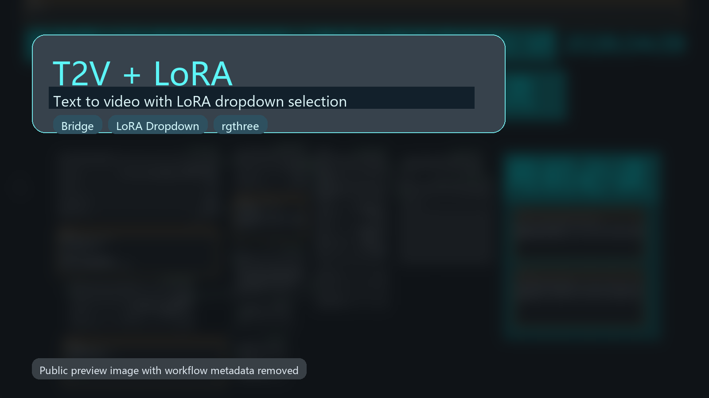
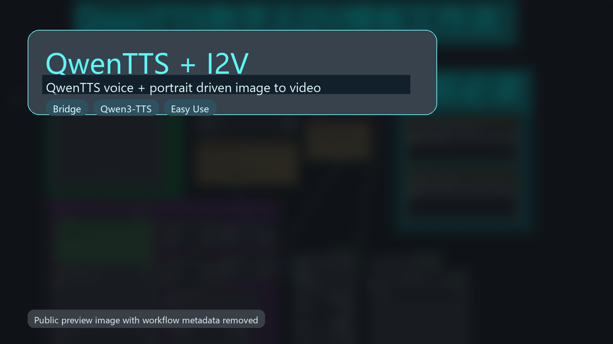
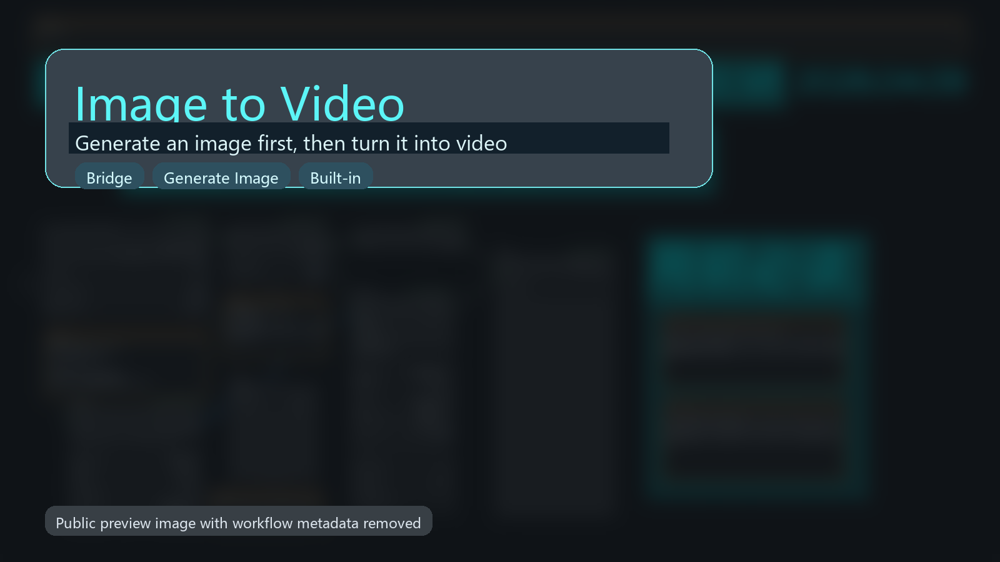
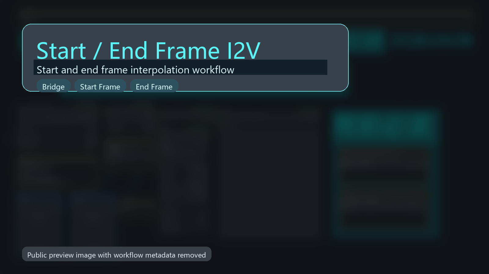

# ComfyUI TY LTX Desktop Bridge

Version: `1.1.0`

ComfyUI 与本地 `LTX Desktop` 的桥接插件。

它不会重写一套视频生成管线，而是把 ComfyUI 节点请求转发给你本机已经能运行的 `LTX Desktop` 后端。

核心链路：

`ComfyUI node -> local LTX Desktop API -> image / video result -> back to ComfyUI`

## Highlights

- Support `LTX2.3-1.0.3` and `LTX2.3-1.0.4` style local desktop backends
- Text to image
- Text to video
- Image to video
- Start / end frame interpolation
- Reference audio driven video generation
- LoRA directory + dropdown selection workflow
- Custom inference steps / model path
- VRAM limit sync and low-VRAM workflow control
- Output directory sync, history loading, batch video utilities

## Install

1. Make sure your local `LTX Desktop` can already start and finish a generation task.
2. Copy this folder into `ComfyUI/custom_nodes/ComfyUI_TY_LTX_Desktop_Bridge`.
3. Restart ComfyUI.
4. Import one of the example workflows from [`examples workflows`](./examples%20workflows).

## Quick Start

Recommended defaults:

- `base_url`: `http://127.0.0.1:3000`
- `launcher_root`: your local folder that contains `run.bat`
- `auto_start`: public examples default to `true`; if you prefer manual startup, turn it off and leave `launcher_root` empty
- `gpu_id`: keep `-1` if you do not want automatic GPU switching

Recommended run order:

1. `TYLTXDesktopConfig`
2. `TYLTXDesktopSetVramLimit`
3. `TYLTXDesktopGenerateVideo`
4. `TYLTXDesktopSaveVideo`

Notes:

- `TYLTXDesktopSetVramLimit` is the recommended single VRAM-policy node.
- `vram_limit_gb = 0` means unlimited prefetch.
- When `low_vram_mode = true`, the low-VRAM policy takes priority over the numeric limit.
- Public example workflows default `low_vram_mode` to `true`.
- Public example JSON files do not contain hard-coded personal paths.

## Example Workflows

The repository now ships with four maintained public workflows.

Their preview images have ComfyUI workflow metadata removed before publication.

<table>
  <tr>
    <td width="50%">
      
       
      <strong>T2V + LoRA</strong>
       
      <a href="./examples%20workflows/t2v_lora_workflow.json"><code>examples workflows/t2v_lora_workflow.json</code></a>
       
      Text-to-video with LoRA dropdown selection.
       
      Optional dependency: <code>rgthree-comfy</code>
    </td>
    <td width="50%">
      
       
      <strong>QwenTTS + I2V</strong>
       
      <a href="./examples%20workflows/qwentts_i2v_workflow.json"><code>examples workflows/qwentts_i2v_workflow.json</code></a>
       
      QwenTTS voice + portrait driven image-to-video workflow.
       
      Optional dependencies: <code>qwen3-tts-comfyui</code>, <code>comfyui-easy-use</code>
    </td>
  </tr>
  <tr>
    <td width="50%">
      
       
      <strong>Image To Video</strong>
       
      <a href="./examples%20workflows/image_to_video_i2v_workflow.json"><code>examples workflows/image_to_video_i2v_workflow.json</code></a>
       
      Generate an image first, then turn it into video.
       
      Uses bridge nodes plus built-in ComfyUI nodes.
    </td>
    <td width="50%">
      
       
      <strong>Start / End Frame I2V</strong>
       
      <a href="./examples%20workflows/start_end_i2v_workflow.json"><code>examples workflows/start_end_i2v_workflow.json</code></a>
       
      Start/end frame interpolation workflow.
       
      Bundled demo inputs are included in <code>examples workflows/input_assets</code>.
    </td>
  </tr>
</table>

## Bundled Input Assets

For public examples that need input images, the repository includes:

- [`examples workflows/input_assets/cat_announcer.png`](./examples%20workflows/input_assets/cat_announcer.png)
- [`examples workflows/input_assets/racecar_start.jpg`](./examples%20workflows/input_assets/racecar_start.jpg)
- [`examples workflows/input_assets/racecar_end.jpg`](./examples%20workflows/input_assets/racecar_end.jpg)

Copy these files into your ComfyUI `input` directory after importing the workflow, or replace them with your own images.

## Main Bridge Nodes

Core:

- `TYLTXDesktopConfig`
- `TYLTXDesktopGenerateImage`
- `TYLTXDesktopGenerateVideo`
- `TYLTXDesktopSaveVideo`

System:

- `TYLTXDesktopSetOutputDir`
- `TYLTXDesktopGetOutputDir`
- `TYLTXDesktopBrowseOutputDir`
- `TYLTXDesktopSwitchGPU`
- `TYLTXDesktopClearGPU`
- `TYLTXDesktopSetVramLimit`
- `TYLTXDesktopGetVramLimit`

LoRA / Models:

- `TYLTXDesktopSetLoraDir`
- `TYLTXDesktopGetLoraDir`
- `TYLTXDesktopListLoras`
- `TYLTXDesktopSelectLora`
- `TYLTXDesktopSetLoraPath`
- `TYLTXDesktopListModels`

Utility:

- `TYLTXDesktopHistory`
- `TYLTXDesktopHistoryItem`
- `TYLTXDesktopLoadHistoryImage`
- `TYLTXDesktopGenerateBatchVideo`
- `TYLTXDesktopDeleteFile`

## Optional Dependencies For Example Workflows

These are not required for the bridge plugin itself, but some example workflows use them:

- `rgthree-comfy`
  - Used by `t2v_lora_workflow.json` for display/debug nodes
- `qwen3-tts-comfyui`
  - Used by `qwentts_i2v_workflow.json`
- `comfyui-easy-use`
  - Used by `qwentts_i2v_workflow.json`

If a dependency is missing, import will show missing-node warnings until you install it or delete the extra nodes from that workflow.

## Notes

- This plugin is a bridge to a local desktop backend, not a standalone LTX runtime.
- Public workflow previews have metadata removed, but the workflow JSON files remain fully importable.
- If a workflow shows obviously stale node fields after an update, recreate the node or re-import the workflow JSON.

## Docs

- [`CHANGELOG.md`](./CHANGELOG.md)
- [`PLUGIN_CONTEXT.md`](./PLUGIN_CONTEXT.md)
- [`examples workflows/README.md`](./examples%20workflows/README.md)
- [`examples workflows/WORKFLOW_GUIDE.md`](./examples%20workflows/WORKFLOW_GUIDE.md)
